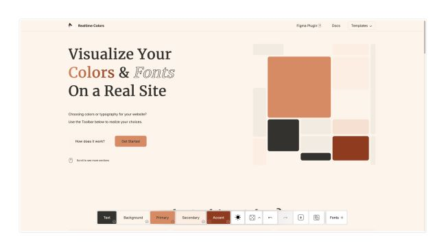
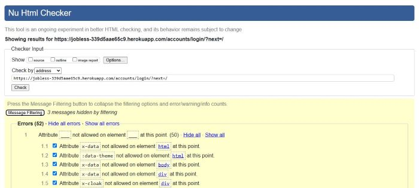

# Jobless

- [Overview](#overview)
  - [Purpose](#purpose)
  - [Target Audience](#target-audience)
- [User Stories](#user-stories)
- [UX Design and Planning](#ux-design-and-planning)
  - [Wireframes](#wireframes)
  - [Accessibility Considerations](#accessibility-considerations)
  - [Database Design](#database-design)
- [Features Implementation](#features-implementation)
 - [Core Features](#core-features)
 - [Advanced Features](#advanced-features)
- [Testing and Validation](#testing-and-validation)
  - [Testing Results](#testing-results)
  - [Validation](#validation)
## Overview

### Purpose
An application to track job searching activities. Logged in users can make a lists of jobs, contacts and events. Jobs can be marked as 'favourites'. Users can update and delete items they have added to their lists to keep an up to date record. 

### Target Audience
The target audience is all job seekers, both out of work and currently employed. Users will benefit from having an easy to use record of their job seeking activities, contacts and appointments. 

## User Stories

| Prioritisation | User Story |
| ----------- | ----------- |
| Must Have| As a **user** I want to **see a list of all the jobs I've added** so that **I can get an overview of my job search progress** |
| Must Have | As a **user** I want to **see a list of contacts associated with each job application** so that **I can quickly find their information** | 
| Must Have | As a **user** I want to **delete an event that I no longer need** so that **I can keep my calendar organized** |
| Must Have | As a **user** I want to **see a list of events associated with each job application** so that **I can see my progress** |
| Must Have | As a **user** I want to**add contact information for people I've interacted with at a company** so that I can **easily keep track of my network** |
| Must Have | As a **user** I want to **edit the details of an event** so that I can **update information if needed** |
| Must Have | As a **user** I want to **add an event to a job application** so that I can **track my interactions** |
| Must Have | As a **user** I want to **easily use the forms for adding and editing information** so that I can **quickly input data without frustration** |
| Must Have | As a **user** I want to **access the website on different screen sizes** so that I can **manage my job applications on any device** |
| Must Have | As a **user** I want to **create an account with an email and password** so that I can **track my applications securely** |
| Must Have | As a **user** I want to **add notes to each job posting** so that I can **record interview details, contact information, and personal observations** |
| Must Have | As a **user** I want to **c**ategorize the job postings by status** so that I can **track my progress** |
| Must Have | As a **user** I want to **update the status of the job postings** so that I can **keep track of them** |
| Must Have | As a **user** I want to **add the details of a job I would like to apply for** so that I can **track potential job opportunities** |
| Should Have | As a **user** I want **the website to look appealing** so that I am **more likely to use it** |
| Could Have | As a **user** I want to **upload my CV** so that **AI can send me suggestions on how to tailor it to each job listing** |

## UX Design and Planning

### Wireframes

#### Home page
##### Desktop

##### Mobile

#### Contacts Page
Jobs and Events pages would have a similar wireframe.
##### Desktop

##### Mobile

### Accessibility Considerations
Pastel colours were selected as desirable and Realtime Colors was used to choose a colour palette with the following chosen for accessibility.

### Database Design
The following database schema was created from the user stories and used as a basis for model creation.

The following changes were made to the original database schema:
- JobPosting:
  - skills field added to implement tags
  - favourites field added to allow for future developement of an add to favourites feature
- Events:
  - contacts field added to allow for the linking of contacts to an event, not currently in use

## Agile Methodology

An agile working methodology was used during the project with a GitHub project board being the basis of this method.

[Project board link](https://github.com/users/katepz/projects/6)

This completed sprint involved the completion of 16 items. The MoSCoW approach to prioritisation was used to ensure that the MVP was completed in good time. Initially all items were placed in the Backlog and as they were moved to To Do, In Progress and Done columns in the board the milestone was changed for a visual check on the progress of the project. Of the 16 items completed 14 had been designated as Must Haves, 1 as a Should Have and 1 as a Could Have. There are no items remaining in the Backlog after this sprint. 

### Images of the Project Board 
#### In Progress:

#### Completed:

## Features Implementation

### Core Features (Must-Haves)
- **Feature 1:** Responsive design, visual design. These can been seen in the images showing the remaining features.

- **Feature 2:** Account creation. Users can create an account to use the features of the application.

- **Feature 3:** Jobs section. Users can add a job with associated details to a list which can be viewed. Jobs can be categorized, a status attached and notes submitted. Once added jobs can be updated or deleted.

- **Feature 4:** Contacts section. Users can add a contact with associated details to a list which can be viewed. Once added jobs can be updated or deleted.

- **Feature 5:** Events section. Users can add an event with associated details to a list which can be viewed. Once added events can be updated or deleted.

- **Feature 6:** Forms. Forms are intuitive to use for swift input and feedback.

### Advanced Features (Could-Haves)
- **Feature 7:** AI CV assistant. Users can upload their CV to ask AI to suggest improvements, eg for a particular job application.

## Technologies Used

### Planning and Design
- GitHUb - project board
- Figma - planning board and wireframes
- Claude - ERD for database
- Realtime Colors - colour palette and accesibility testing
- Favicon generator - to produce favicon
- Techsini.com - mockup generator

### Languages
- HTML5 
- CSS3 
- Python3
- Javascript 
- Markdown

### Frameworks
- Tailwind
- Django4

### Database
- Postgres - supplied via Code Institute

### Development
- Git - for version control
- Gitpod 
- GitHub 

### Validation and Testing
- HTML - The W3C Markup validation Service
- CSS - The W3C CSS Validation Service
- Python - The Code Institute Python Linter
- Lighthouse
- JS Hint

### Deployment
- Heroku 

### AI
- Claude

## Testing and Validation

### Testing Results
| Feature | Test | Result |
| ----------- | ----------- | ----------- |
| Responsive design | Application displays as required on different size devices | Success/Fail |
| Account | Click on sign up button to enter details | Success |
| Account | Click on submit button to create an account | Success |
| Account | Click on sign in button to log in | Success |
| Account | Click on sign out button to log out | Success |
| Jobs | Click on icon on navbar to display jobs list | Success |
| Jobs | Click on add job button to display jobs form | Success |
| Jobs, Forms | Click on save job button to enter details | Success |
| Jobs | Click on view job icon to view full job details | Success |
| Jobs | Click on edit job icon to update job details | Success |
| Jobs | Click on delete job icon to delete job | Success |
| Contacts | Click on icon on navbar to display contacts list | Success |
| Contacts | Click on add contact button to display contacts form | Success |
| Contacts, Forms | Click on save contact button to enter details | Success |
| Contacts | Click on view contact icon to view full contact details | Success |
| Contacts | Click on edit contact icon to update contact details | Success |
| Contacts | Click on delete contact button to delete contact | Success |
| Events | Click on icon on navbar to display events list | Success |
| Events | Click on add event button to display events form | Success |
| Events, Forms | Click on submit button to enter details | Success |
| Events | Click on view event icon to view full event details | Success |
| Events | Click on update event button to update event details | Success |
| Events | Click on delete event button to delete event | Success |
| AI Assistant | Click on icon on navbar to display AI Assistant | Success |
| AI Assistant | Paste Cv into text area | Success |
| AI Assistant | Type question into text area | Success |
| AI Assistant | Click on get AI feedback button to activate AI Assistant | Success |

Lighthouse testing results leave some scope for improvements in accessibility.

### Validation

HTML - errors detected using W3C markup validation. To be addressed in next sprint.

CSS - errors detected using W3C css validation. To be addressed in next sprint.

Javascript - no errors detected using JS Hint

Python - errors detected using CI python linter

## Deployment

### Deployment Process
## Deployment

The deployed project can be found at:
[Deployed Site](https://jobless-339d5aae65c9.herokuapp.com/)

This project was deployed to Heroku from the main branch of the Jobless repository on GitHub. 

The project was reployed  after new features were made functional so that continuous checking of the deployed site could be made and any errors picked up early.

### Pre Deployment
- requirements.txt file to be up to date with installed Python modules needed for effective deployment
- Procfile used to configure the application as a gunicorn web app
- runtime.txt populated with Python version for Heroku to use
- Add Heroku to allowed apps in IDE project settings.py file
- Generate SECRET_KEY
- Environment variables of a senstive nature - DATABASE_URL, CLOUDINARY_URL, SECRET_KEY - to be added to env.py file which is not pushed to GitHub

### Deployment Steps
- Create Heroku account
- Create a new Heroku app
- Select region as Europe
- Add environment variables manually to Heroku in the Config Vars section
- Connect Heroku to GitHub repository using the search function
- Once branch is merged successfully with the main branch in the GitHub repo the main branch can be deployed
- In Heroku dashboard click on Deploy tab - see image below
- Make sure main branch is selected for deployment, click Deploy - see image below
- Once the build process has finished click to open the app - see image below

## Reflection on Development Process

### Successes
Effective use of AI, implementation of features, final product is visually appealing.

### Challenges
Integration of frameworks, one merge conflict issue.

## Code Attribution
- Guy Clements - use of his project as a basis for Jobless
- Claude AI for models

## Future Improvements
Briefly discuss potential future improvements or features that could be added to the project.  
**Guidance:** Reflect on potential enhancements that could be made to the project after Phase 4: Final Testing, Debugging & Deployment. These could be Could user story features you didn’t have time to implement or improvements based on testing feedback.